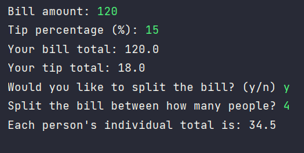

# Bill Handler

A short Python program that helps you calculate the total bill amount, tip amount, and optionally split the bill among
multiple people. It provides a simple and convenient way to handle bill-related calculations.

## Prerequisites

* Python 3.x

## Features

- Calculates the total bill amount based on the bill amount and tip percentage.
- Calculates the tip amount based on the bill amount and desired tip percentage.
- Option to split the bill evenly among a specified number of people.
- Rounded calculations to two decimal places for convenience.

## Visual Example 

## Usage

1. Make sure you have Python installed on your system.
2. Clone or download the `bill_handler.py` file.
3. Open a terminal or command prompt and navigate to the directory where the `bill_handler.py` file is located.
4. Run the program by executing the following command:
5. Follow the prompts to enter the bill amount, tip percentage, and choose whether to split the bill.

## Credits

This project was created by [th0tmaker](https://github.com/th0tmaker)
as part of a [Python Miscellaneous](https://github.com/th0tmaker/PythonMisc) repository.
It may serve as a starting point for further enhancements and customizations.
